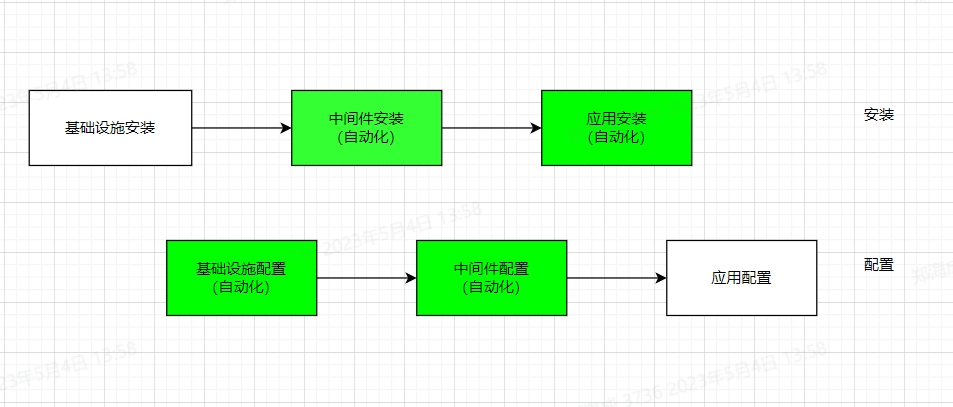

# a2z_ansible

## 功能
安装、配置各种中间件、数据库、微服务组件



## 安装

- a2z_ansible 依赖 Ansible，所以需要在 Ansible controller（控制面）  上安装 Ansible 

```shell
# 以 Anolis 8.6 操作系统为例
pip3 install -U pip setuptools
python3 -m pip install --user ansible -i https://pypi.douban.com/simple
export PATH=~/.local/bin:$PATH
```


## 使用

- 1. 修改本机上的 /etc/hosts

```shell
# vi /etc/hosts
192.168.3.215   mysql57.db # mysql 对应的主机
192.168.3.216   app.mw # nginx redis nacos 对应的主机
192.168.3.217   app.back # springboot 对应的主机
```

- 2. 拷贝公钥到待安装的主机上

```shell
ssh-copy-id -i ~/.ssh/id_rsa.pub <host>
```

- 3. 安装 mysql 单节点

    - 修改配置 MySQL 安装参数（按照需要修改）
    
    修改 roles/mysql_install/defaults/main.yml 文件
    
    ```shell
    # mysql 安装包在Ansible controller上所在的目录
    mysql_packages_dir: /root/softwares/mysql/

    # mysql 安装包的名字
    mysql_package: mysql-5.7.39-linux-glibc2.12-x86_64.tar.gz
    # mysql_package: mysql-8.0.30-linux-glibc2.17-x86_64-minimal.tar.xz

    # mysql 安装目录
    mysql_base_dir: /usr/local/mysql/

    # mysql 真正的 datadir 就会是 mysql_data_dir_base + mysql_port
    mysql_data_dir_base: /glzt/mysql/
    # mysql 端口
    mysql_port: 3306

    # root 密码
    mysql_root_password: mtls0352

    ```

    - 执行 mysql 安装 playbook

    ```shell
    ansible-playbook -i inventory/hosts.yml install-mysql.yml
    ```

- 4. 安装 nacos redis nginx

    - 修改配置安装参数（按照需要修改）

    Nacos配置文件修改：roles/nacos_install/defaults/main.yml

    ```shell
    # nacos 安装包在Ansible controller上所在的目录
    packages_dir: /root/softwares/nacos
    nacos_package: nacos-server-2.1.2.zip

    # 是否安装 jdk
    java_install: true

    # jdk 包名称
    java_package: 
    - java-11-openjdk.x86_64
    - java-11-openjdk-devel.x86_64
    
    # nacos 安装目录
    nacos_home: /glzt/nacos
    ```

    Redis配置文件修改：roles/redis_install/defaults/yml

    ```shell
    # redis 版本
    redis_version: 5.0.14
    # redis 安装目录
    redis_install_dir: /glzt/redis
    # redis 端口
    redis_dir: /glzt/redis/{{ redis_port }}

    ```

    Nginx配置文件修改：roles/nginx_install/defaults/yml（安装包在本地）

    ```shell
    packages_dir: /root/softwares/nginx
    nginx_package: nginx-1.23.4

    ```

    - 执行安装 playbook

    ```shell
    ansible-playbook -i inventory/hosts.yml install-application.yml
    ```

- 5. 安装 springboot 后端服务

    - 配置 安装参数
    
    修改 roles/springboot_install/defaults/main.yml 文件
    
    ```shell
    # Install java by default. Optional
    springboot_java_install: true
    springboot_java_home: /usr/lib/jvm/jre-openjdk # /usr/lib/jvm/jre-openjdk, if springboot_java_install == true

    # User and Group
    springboot_group: springboot
    springboot_user: springboot

    # Nacos
    springboot_nacos: 
    url: "localhost:8848" # 指定 Nacos 地址，默认为：localhost:8848
    namespace: "GoBroad" # 指定 命名空间，默认为：public
    user: "nacos" # 指定 用户名，默认为：nacos
    password: "nacos" # 指定 密码，默认为：nacos

    # Backends
    springboot_applications: 
    - app_short_name: 'AdminService'
      app_long_name: 'AdminService'
      deploy_folder: '/glzt/PatientService/AdminService'
      app_bin: 'AdminService.jar' 
      src_file: '/root/softwares/application/AdminService.jar'
      configuration_template: false
      startup: 'startup.sh'
      jvm_opt: "-XX:MetaspaceSize=512m -XX:MaxMetaspaceSize=1024m -Xms256m -Xmx256m" # 指定 JVM 参数
    - # 有多少个服务加多少 application
    - # 有多少个服务加多少 application
    - # 有多少个服务加多少 application
    ...
    
    ```

    - 执行 springboot 安装 playbook

    ```shell
    ansible-playbook -i inventory/hosts.yml install-application.yml
    ```

- 6. All-in-one 一次性安装所有的东西

  - 配置 安装参数，参考 3、4、5修改 
    roles/springboot_install/defaults/main.yml
    roles/nginx_install/defaults/main.yml
    roles/redis_install/defaults/main.yml
    roles/nacos_install/defaults/main.yml
    roles/mysql_install/defaults/main.yml

  - 执行 springboot 安装 playbook
    ```shell
    ansible-playbook -i inventory/hosts.yml install-allinone.yml
    ```

<!-- ```shell
export ANSIBLE_LIBRARY=`pwd`/plugins/modules && ansible-playbook -e hostgroup=oracle -i inventory/hosts.yml single-oracle.yml
``` -->